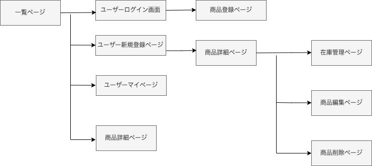

# アプリケーション名
<h2>Tik Stock</h2>
  

# アプリケーション概要

登録商品の在庫管理,チームでスマホPC何処からでも在庫管理ができる。
  
# URL※
https://tikstock-0415.herokuapp.com/
  

# テスト用アカウント
Basic認証のIDとパスワード |  export BASIC_AUTH_USER='admin'
export BASIC_AUTH_PASSWORD='2222'

投稿者用のメールアドレスとパスワード   | メールアドレス：test@test.com
                                   パスワード：t123456

その他利用者用のメールアドレスとパスワード | メールアドレス：hoge@hoge.com
                                      パスワード：h123456
  
# 利用方法
## 商品登録
1.ログインユーザーはトップ画面から新規商品を登録を行う

2.新規登録画面より（商品名、商品情報、在庫数）を入力し登録ボタンを押す

3.一覧画面に登録商品一覧が表示される

## 在庫管理
1.在庫数変更確認したい商品を一覧から検索し在庫管理を行う

2.ログインユーザーは指定した商品の在庫数を変更する
  
  

# アプリケーションを作成した背景
日々の業務で消耗品を管理する業務があり、現状は紙の台帳で管理しており事務所にいなければ在庫数の確認や外からでは毎回事務所に電話で確認することが多いのでコミニュケーションコストがかかるなど問題点があった。
スマホからもタイムリーに在庫数をチームで管理でき、ペーパーレスで最新の情報を共有できるアプリがあれば便利だと思い在庫管理アプリを作成した。
  
  

# 実装した機能についての画像やGIFおよびその説明※

<h2>スマホ画面</h2>

# DB 設計

  

# 画面遷移図

  

# 開発環境
HTML・CSS・Ruby・Ruby on Rails・JavaScript・GitHub・Bootstrap
  

# ローカルでの動作方法※
  

# 工夫したポイント
スマホからでも対応できるようBootstrapを用いてレスポンシブ対応にし見た目はシンプルで誰でも使いやすいよう意識した。

